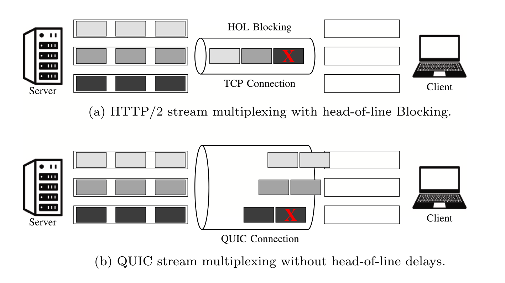

- [The QUIC Transport Protocol: Design and Internet-Scale Deployment](https://doi.org/10.1177/14614448251336438)
- [pFabric: minimal near-optimal datacenter transport](https://doi.org/10.1145/2486001.2486031)
- [Exploiting stream scheduling in QUIC: Performance assessment over wireless connectivity scenarios](https://doi.org/10.1016/j.adhoc.2024.103599)

QUIC is a transport-layer protocol that underlies the latest version of the Hypertext Transfer Protocol, HTTP/3. As a transport layer protocol, it describes a new way of how two endhosts can establish a connection and communicate over the Internet. Its main goal is to reduce communication latency. 
Launched in 2016 and standardized by IETF in 2021, QUIC is now used by major internet players like Meta, Google, Cloudflare, Alibaba, and Microsoft. As of early 2024, it's estimated to carry nearly half of all internet traffic across Europe, Latin America, and the United States. \[1\] \[2\]

## The QUIC Transport Protocol: Design and Internet-Scale Deployment

QUIC replaces the traditional HTTPS stack (IP → TCP → TLS → HTTP/2) with a remodeled stack built on IP → UDP → QUIC → HTTP/3. Their main claim is that TCP has ossified. That is, updating or enhancing the TCP protocol would require massive, Internet-wide device and software changes, making such evolution impractical. Therefore, they use another transport-layer protocol already well supported by Internet devices, UDP, as the foundation for their new protocol.

QUIC has three major catches: 
1. It prevents TCP's Head-of-line blocking problem by introducing the *stream* abstraction, where each established connection can have multiple independent streams (typically corresponding to different application tasks or resources)
    - In contrast, TCP provides a single, ordered byte stream without internal separation between tasks (all packets for different tasks are interweaved in one single big "stream"). Therefore, the loss of a single TCP packet delays the delivery of all subsequent packets (regardless of which task they belong to) until the missing packet is retransmitted.
    -  
    - `TODO`: Give a typical stream assignment example
2. It uses a cryptographic handshake that replaces the three-way handshake in TCP. 
3. Its packets are end-to-end encrypted and authenticated, which prevents it from being modified by middleboxes (e.g., NATs, firewalls)

We chose QUIC because: 
1. We want to exploit the stream abstraction in QUIC, annotate flows by their expected length, and build a scheduling policy that favors shorter streams over longer streams. 
2. QUIC is newer, more timely and does not yet include the scheduling mechanism we aim to design. 

## pFabric: minimal near-optimal datacenter transport

Extensive research has been done in TCP scheduling that takes in consideration of shorter v.s. longer flows. 

The paper points out that short flows in data centers are extremely latency-sensitive, yet in traditional TCP-based data center, they suffer from high completion times because they get queued behind large background flows.

pFabric’s key contribution is a near-optimal transport design: It assigns each flow a priority value (typically based on remaining flow size or deadline), which is inserted into every packet header. In this set up:
- Switches maintain very small buffers and always serve the highest-priority packets first. If the buffer becomes full, they drop the lowest-priority packet.
- End-hosts start sending at full rate and only back off if persistent packet loss occurs. 

We take inspiration from assigning priorities to packets and want to bring this idea to TCP’s newer counterpart — QUIC.

## Exploiting stream scheduling in QUIC: Performance assessment over wireless connectivity scenarios

`TODO`

## Reference

\[1\] Perarnaud, C., & Musiani, F. (2025). QUIC, or the battle that never was: A case of infrastructuring control over Internet traffic. New Media & Society, 0(0). https://doi.org/10.1177/14614448251336438

\[2\] Cisco (2024) The Internet and CDNs. Some Observations from a Network Perspective. Available at: https://2024.apricot.net/assets/files/APIC378/the-internet-and-cdn_1709097576.pdf 

\[3\] Fernández, Fátima, Fátima Khan, Mihail Zverev, et al. 2024. “Exploiting Stream Scheduling in QUIC: Performance Assessment over Wireless Connectivity Scenarios.” Ad Hoc Networks 164 (November): 103599. https://doi.org/10.1016/j.adhoc.2024.103599.